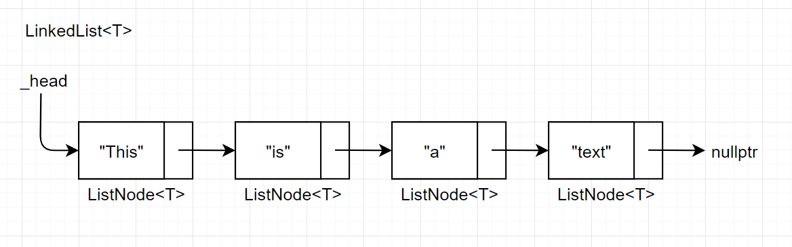

# 1. Титульный лист и первые страницы – по требованиям (+англ. аннотация) на www.eltech.ru

# 2. Цель работы
Закрепление знаний и навыков по представлению и обработке текстовой информации с использованием списков и файлов на основе набора функций.

# 3. Формулировка задания

4.13) Текст представляет собой последовательность отдельных предложений, содержащих слова и знаки пунктуации.\
    Преобразовать текст в соответствии с последовательностью команд редактирования, которые должны позволять вставлять, удалять и заменять заданные слова в определенных предложениях.

## Команды редактирования:
1. Удалить заданное слово в предложении, (Р.1)
2. Заменить заданное слово в предложении на новое слово, (Р.4)

## Указание определенного предложения:
Предложение, содержащее указанное слово, (П.4)

## Указание заданного слова:
Слово, заканчивающееся заданной последовательностью символов (С.8)


# 4. Внешний формат хранения данных

**Входные и выходные файлы:**\
Последовательность отдельных предложений, содержащих слова и знаки пунктуации.

# 5. Внутренний формат хранения данных

## Структура данных "Односвязный линейный список"



### Шаблон LinkedList\<T>
Объявлен шаблон структуры `LinkedList<T>`.\
Структура хранит указатель типа `ListNode<T>*` на `_head` — корневой узел списка.

### Шаблон ListNode\<T>
Объявлен шаблон структуры `ListNode<T>`.\
Структура хранит в себе какое-либо значение `Value` и указатель на следующий узел списка.


## Sentence
Структура `Sentence` представляет собой последовательность слов в рамках одного предложения.

Она объявлена следующим образом:
```cpp
using Sentence = LinkedList<std::string>;
```

Поэтому `Sentence` фактически является `LinkedList<std::string>`.

## Text

При чтении входного текста все данные из него сохраняются в структуру `Text`.

`Text` хранит в приватном поле структуру `LinkedList<Sentence*>`, а также некоторые методов для работы с этим полем.